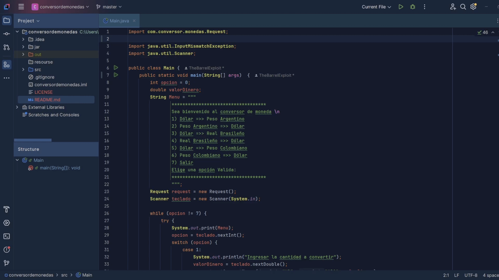
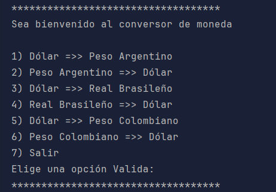
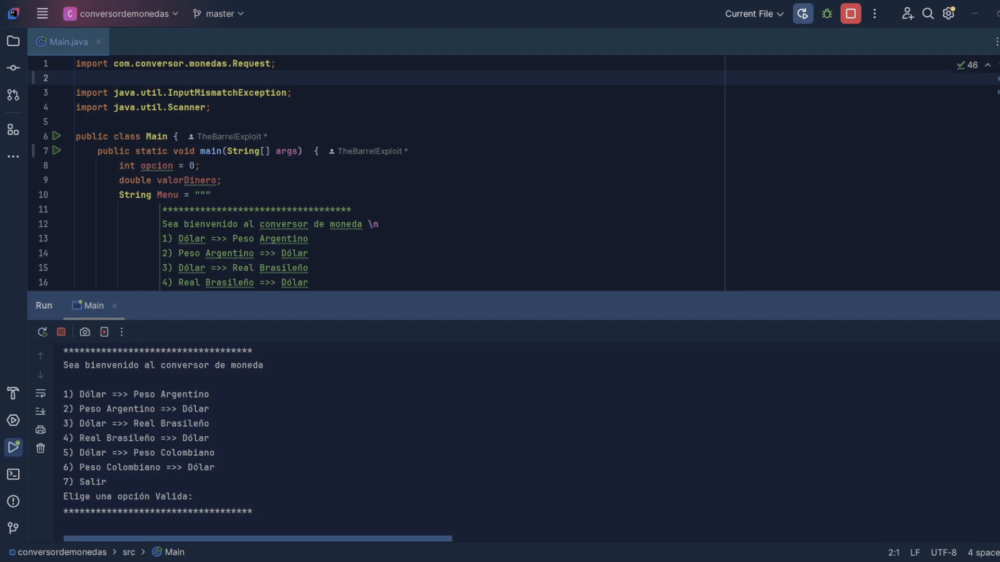

# Challenge Conversor de monedas

### Conversor de monedas creado utilizando tecnologías como lo son Java17, utilizando la api de exchangerate para el reto de Alura Latam.


Para clonar el proyecto se realiza los siguientes comandos:

```
mkdir conversordemonedas
cd conversordemonedas 
git clone https://github.com/TheBarrelExploit/ConversorDeMonedasAlura.git
cd ConversorDeMonedasAlura 
```
# :hammer_and_wrench: Lenguajes,tecnologías e IDE utilizados:
<div> 
 &nbsp;
 &nbsp;
</div>

# Instalación de dependencias:
Se requiere la incorporación del JAR de la libreria Gson, para esto, toca realizar la configuración de la ruta del jar, en este caso
para obtener dicho archivo, desde la pagina oficial de maven o directamente en la carpeta del proyecto denominada "jar", se realiza la 
instalación en las configuraciones del proyecto.

# Obtener la apikey
Para el funcionamiento de la aplicación, se requiere una apikey de la siguiente pagina https://www.exchangerate-api.com/, con el fin de 
obtener los valores actuales de las divisas utilizadas, se requiere realizar el registro en la pagina para obtenerla.


# Ejecutar proyecto
Con el proposito de ejecutar el programa, se debe ir al archivo denominado Main, donde se maneja todo mediante consola

# Variables de entorno
Para este proyecto se requiere tener una variable con el siguiente nombre:
- `KEYVALUE`: apiKey
En este caso se obtiene de las variables de entorno de windows
# Menú


# 🔨 Funcionalidades 
- `Funcionalidad 1`: Conversor de monedas de Dolar, Peso Argentino
Peso colombiano y real brasileño.

  
# Demo ⚙️
- Consulta DIVISA



# Licencia 📄
Este proyecto está bajo la Licencia MIT - mira el archivo [LICENSE](LICENSE) para mas detalles para detalles


